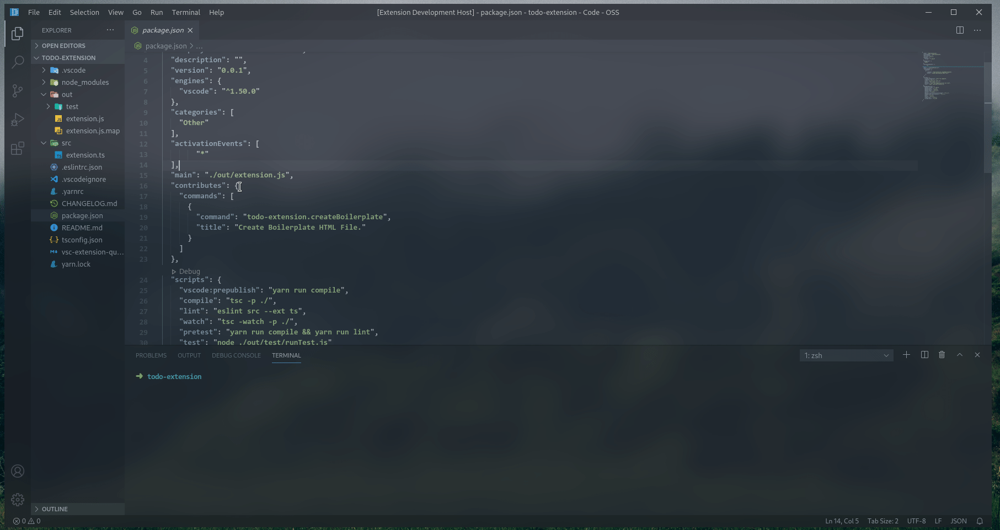

# Catto Code README
Everyone loves cattos, right?

## Features

Catto Code is a *useful* extension for if you have been in flow for too long and need a break.
This extension lets you relate to the struggles of coding with cats, they code for a bit, then they get sleepy.

## Release Notes

Users appreciate release notes as you update your extension.

### 0.0.1

Initial release of CattoCode

